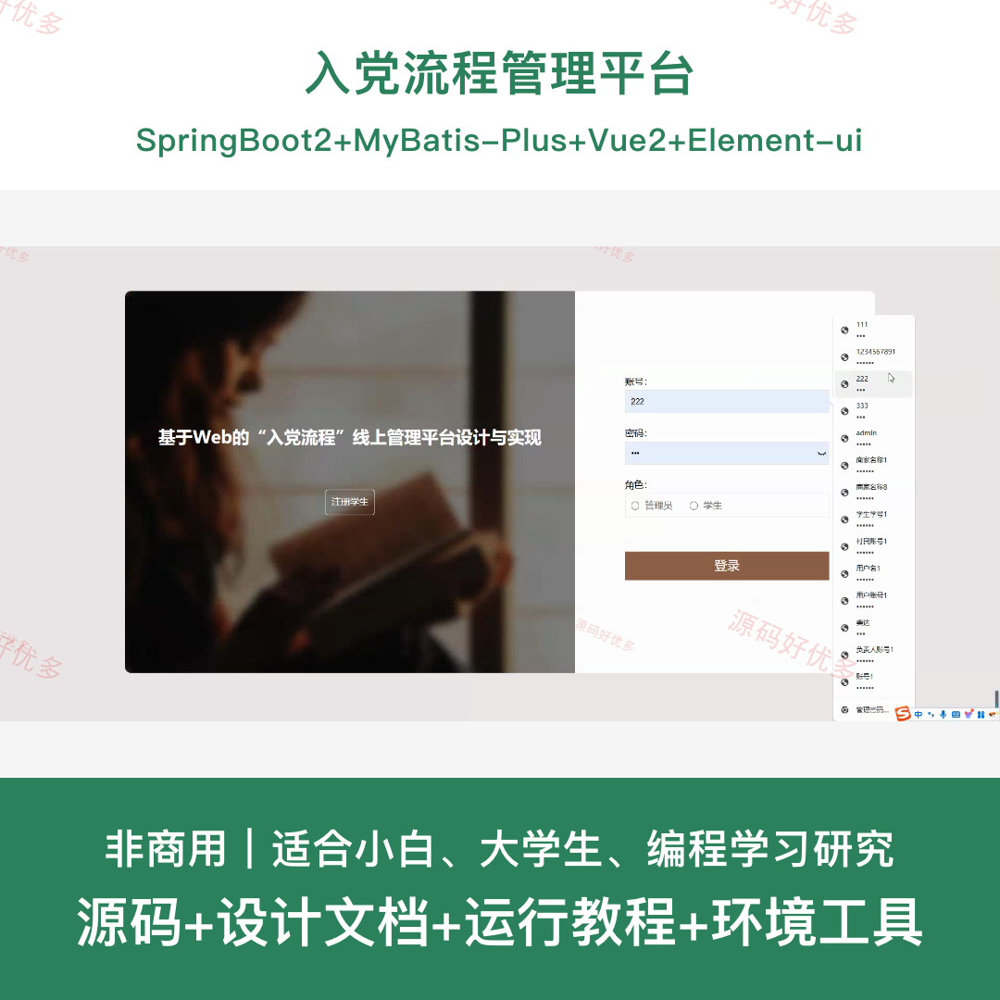
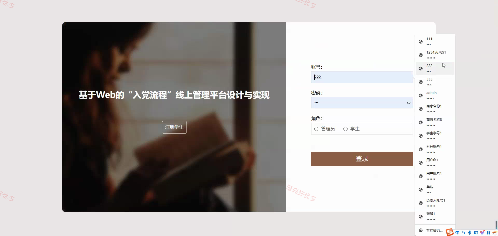
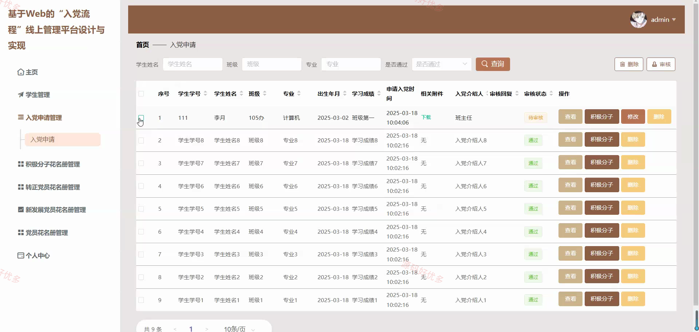
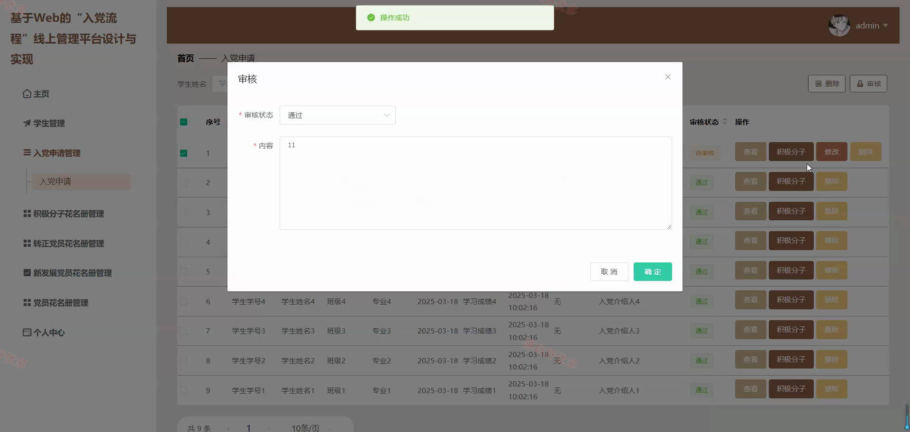
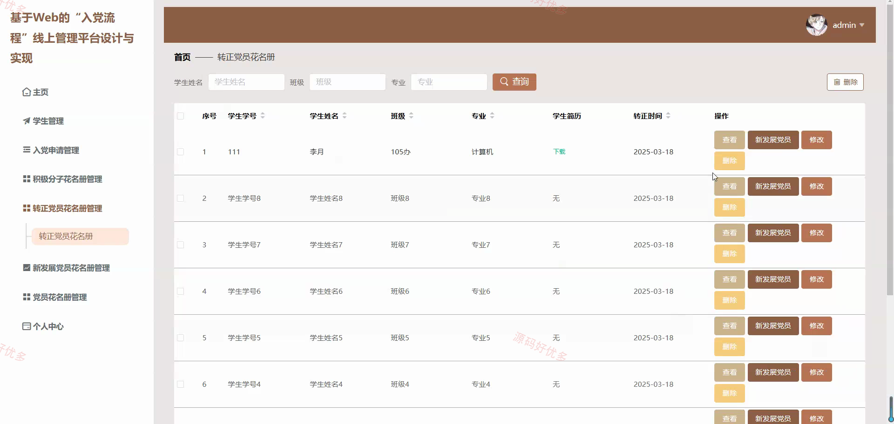
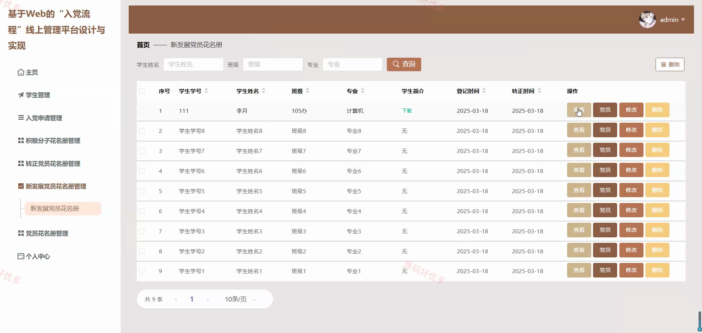
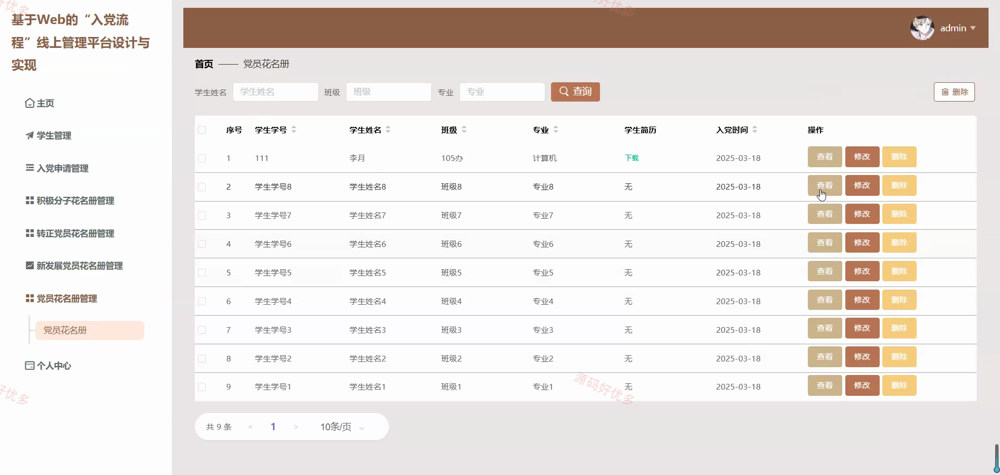
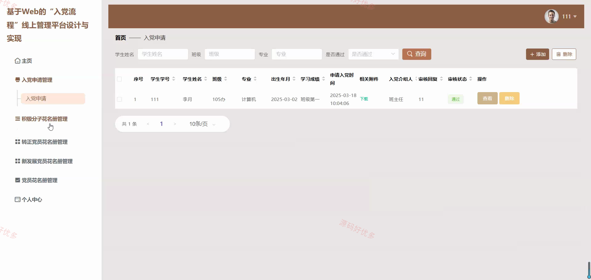
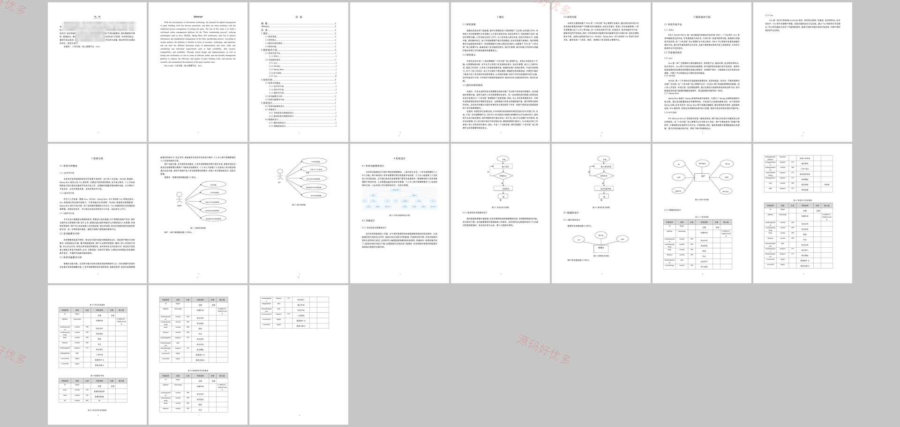

# springbootA558D
入党流程管理平台
## 源码问题查看主页咨询

### 一、关键词
入党流程线上管理、入党申请、积极分子管理、党员名册、转正管理

### 二、作品包含
源码+数据库+设计文档+全套环境和工具资源+本地部署教程

### 三、项目技术
前端技术： Html、Css、Js、Vue2.6、Element-ui
后端技术：Java、SpringBoot2.2.2、MyBatis-Plus

### 四、运行环境（以下版本亲测，其他版本兼容性请自行测试）
开发工具：IDEA/eclipse + VSCODE

数据库：MySQL5.7+（共9张表）

数据库管理工具：Navicat10以上版本

环境配置软件： JDK1.8 + Maven3.6.3

前端Nodejs：14+

浏览器：谷歌浏览器

### 五、项目介绍
项目编号：springbootA558D

入党流程管理平台围绕学生入党申请、积极分子培养、发展党员、党员花名册和转正管理等业务展开，支持学生提交材料、管理员审核维护流程数据，便于完成党务流程线上化演示。

角色：管理员、学生

用户功能：学生注册登录、入党申请提交、材料上传、申请进度查看、个人信息维护。

管理员功能：学生管理、入党申请审核、积极分子管理、发展党员管理、党员转正管理、基础配置维护。

### 六、运行截图

